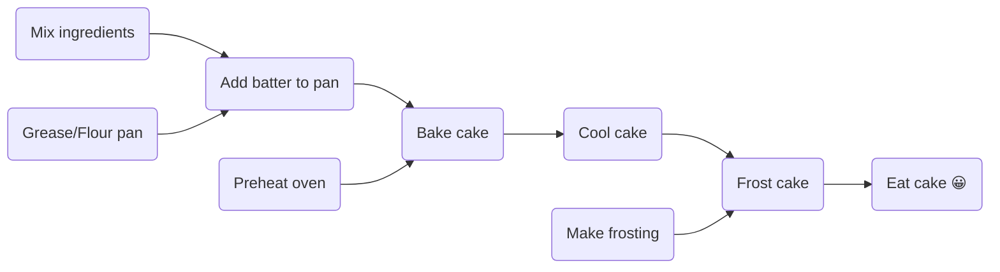

<div align="center">
	
</div>
<br/>
<br/>
<hr/>

# A simple graph library
*Graphology* is yet another graph library implementing various classical algorithms. It uses various C++23/20 features like: coroutines/generators, concepts, ranges/views, ... in order to generate an easy to use API.

## Graph types
There are two types of graph classes:
- Classes implementing the GraphImpl concept
- Specializations of the template class Graph

GraphImpl are the core classes:
- vertices are identified with integers. 
- Edges are identified by the starting and ending
- All edges have an integer weight
- There can be only one "directed" edge between two vertices. But there can be 2 edges if they are of opposite direction.

Graph classes are wrappers around the GraphImpl classes and allow to define vertices with other types than integers.

Both types can be used. Graph instances add an extra layer which can impact performances (when dealing with a large number of vertices) but can ease their use.

## Graph implementations
There are two type of implementations:
- Sparse graphs which use an adjacency list for the edges
- Dense graphs which uses an adjacency matrix for the edges

## Directed and undirected graphs.
Graph and GraphImpl can be:
- Directed
- Undirected. In this case, there will be always 2 "directed" node between 2 vertices with the same weight buf with opposite direction

## Example: 

This example shows how to implement the topological sort of the following graph (how to cook a cake 😀):



```C++
#include <grafology/grafology.h>
#include <print>

namespace g = grafology;
// a directed sparse graph which uses strings as vertices identifiers and integers as edges weights
using Graph = g::DirectedSparseGraph<std::string, int>;
using Edge = Graph::Edge;

std::vector<Edge> edges {
        //  weights are set to 1 by default
        {.start="Mix ingredients", .end="Add batter to pan"}, 
        {"Grease/Flour pan", "Add batter to pan"}, 
        {"Add batter to pan", "Bake cake"}, 
        {"Preheat oven", "Bake cake"}, 
        {"Bake cake", "Cool cake"}, 
        {"Cool cake", "Frost cake"}, 
        {"Make frosting", "Frost cake"}, 
        {"Frost cake", "Eat cake :-)"}, 
    };


int main () {
    Graph graph(10);
    graph.set_edges(edges, true);
    for (const auto& [group, vertex] : g::topological_sort(graph)) {
        std::println( "Group {}: '{}'", group, vertex);
    }
    return 0;
}
```
Output:
```bash
Group 0: 'Mix ingredients'
Group 0: 'Grease/Flour pan'
Group 0: 'Preheat oven'
Group 0: 'Make frosting'
Group 1: 'Add batter to pan'
Group 2: 'Bake cake'
Group 3: 'Cool cake'
Group 4: 'Frost cake'
Group 5: 'Eat cake :-)'
```

## Platforms
This code has been tested on:
- Windows 11 - Visual Studio Tools 17.12
- Linux (Ubuntu 24.04) - g++ 14.2 & clang-19
- MacOS (15.1) - g++ 14.2


See the **[documentation](docs/README.md)** for more details.