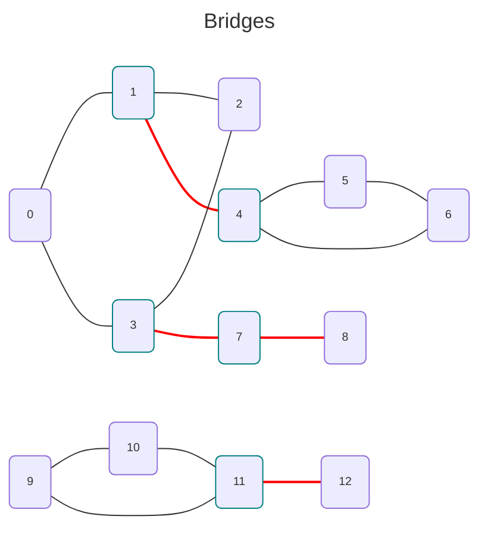

<div align="center">
    
</div>
<hr/>

# Bridges and Articulation Points (or Cut Vertices)
## Bridges
A *bridge* of a graph $G(E,V)$ is an edge such as when removed, increases the number of disconnected components.

An *articulation point* (or *cut vertex*) is defined as a vertex which, when removed along with associated edges, increases the number of disconnected components

Both implementations are slight variations on the [Tarjan's bridge-finding algorithm](https://codeforces.com/blog/entry/71146)



*NB: a bug in Mermaid shows "undirected" edges as "directed". So all the arrows should not been drawn.*

## Requirements
- The graph must be undirected

## Complexity
- The performance is $O(\lVert V \rVert + \lVert E \rVert)$.

## Usage
```C++
#include <grafology/algorithms/articulation_points.h>
#include <grafology/algorithms/bridges.h>
namespace g = grafology;

g::SparseDirectedGraph graph(20);
// ....
for (const auto& edge: g::bridges(graph) {
    // ....
}

// ....
for (const auto& vertex: g::articulation_points(graph) {
    // ....
}
```
