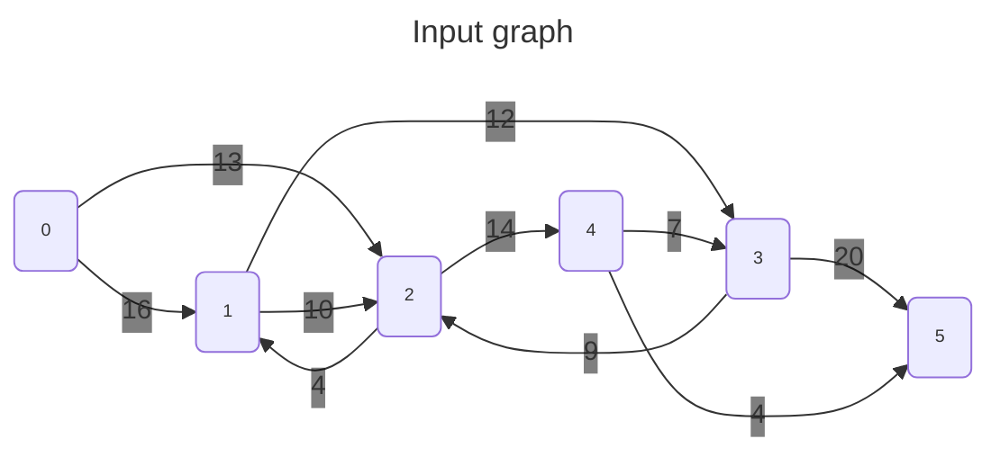
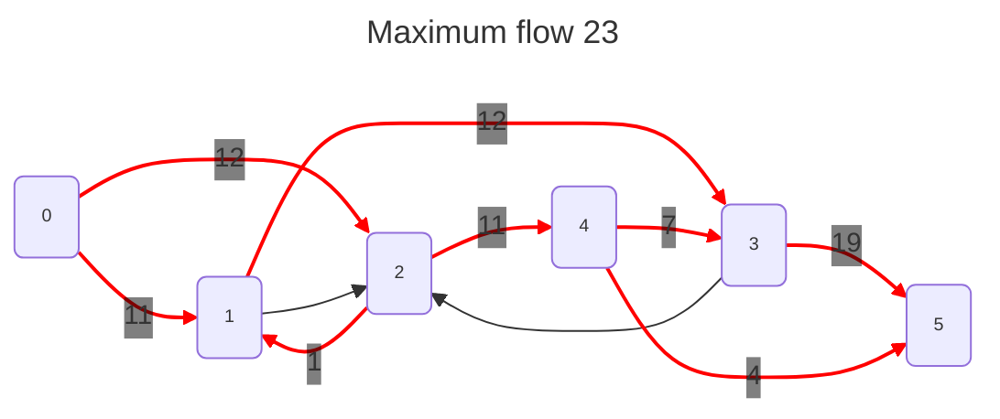

<div align="center">
    
</div>
<hr/>

# Maximum flow
Given a directed graph $G(V,E)$ which represents a flow network where edge weights are the edge capacities.
We want to find the maximum possible flow between the source $s$ and the sink $e$.





## Requirements
- The graph must be directed

## Complexity
- The work case performance is $O(\lVert E \rVert f)$ where $f$ is the maximum capacity.

## Usage
```C++
#include <grafology/algorithms/maximum_flow.h>
namespace g = grafology;

g::SparseDirectedGraph graph(20);
Vertex start;
Vertex end;
// ....
auto max_flow = g::maximum_flow(graph, start, end);
// ....

```

## Notes
A possible better algorithm is the [Push Relabel Algorithm](https://en.wikipedia.org/wiki/Push%E2%80%93relabel_maximum_flow_algorithm). This will be investigated later.

