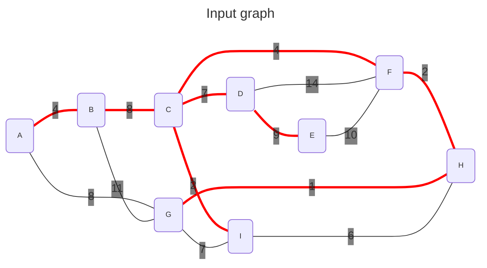
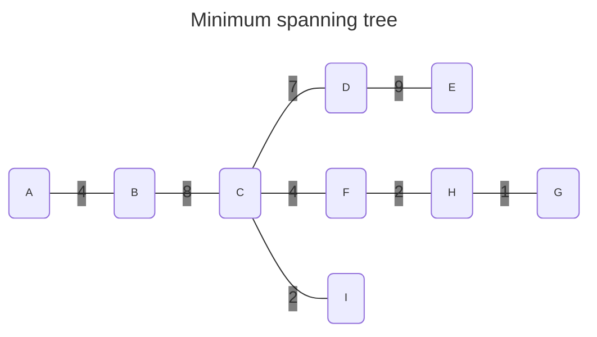

<div align="center">
    
</div>
<hr/>

# Minimum spanning tree
For an undirected graph $G(V,E)$, a *spanning tree* is a subset of edges such as:
- it touches all the vertices of the graph
- it forms a tree (G is connected without cycles)

A minimum *spanning tree (MST)* or *minimum weight spanning tree* is the spanning tree with the least total edge cost.

The code is an implementation of [Kruskal's algorithm](https://en.wikipedia.org/wiki/Kruskal%27s_algorithm)






*NB: a bug in Mermaid shows "undirected" edges as "directed". So all the arrows should not been drawn.*

## Requirements
- The graph must be undirected
- The graph must be acyclic
- The graph can't have disjoint sub-graphs

## Complexity
- The complexity is $O(\lVert E \rVert \log{(\lVert E \rVert)})$

## Usage
```C++
    #include <grafology/algorithms/minimum_spanning_tree.h>
    namespace g = grafology;

    g::SparseUndirectedGraph graph(20);
    // ....
    auto mst = g::minimum_spanning_tree(graph);
    // ....

```
