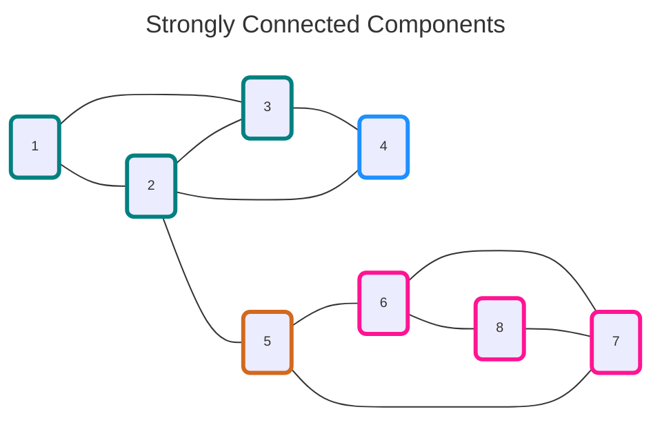

<div align="center">
    
</div>
<hr/>

# Strongly Connected Components
Given a directed grap $G(V, E)$, a **Strongly Connected Component** is a subset of $G$, such as:
- any two vertices in the *SCC*  are mutually reachable. I.e., for any vertices $u$ and $v$ of the *SCC*, there is a directed path between $u$ and $v$.
- the addition of any vertex to the ^SCC* breaks the first condition

The code is an implementation of [Tarjan's strongly connected components algorithm](https://en.wikipedia.org/wiki/Tarjan%27s_strongly_connected_components_algorithm)



## Requirements
- The graph must be directed

## Complexity
- The performance is $O(\lVert V \rVert + \lVert E \rVert)$.

## Usage
```C++
    #include <grafology/algorithms/strongly_connected_components.h>
    namespace g = grafology;

    g::SparseDirectedGraph graph(20);
    // ....
    for (const auto& scc: g:strongly_connected_components(graph)) {
        // scc is a vector containing the vertices defining the SCC
        // ...
    }
    // ....

```
