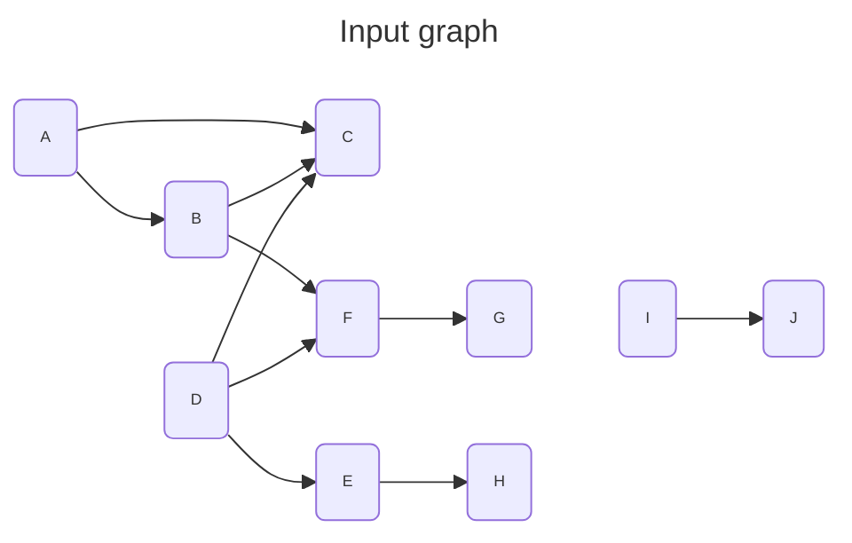
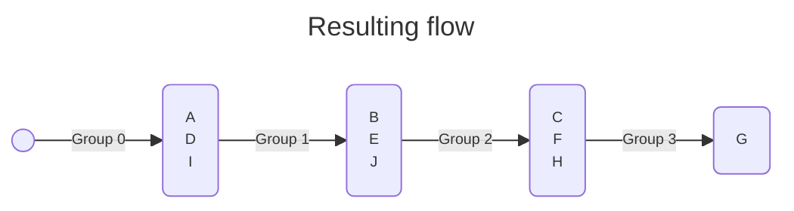

<div align="center">
    
</div>
<hr/>

# Topological sorting
Topological sorting is a linear ordering of vertices such that for every directed edge $u \rightarrow v$, vertex $u$ comes before $v$ in the ordering.

Here a level index is also given with the vertices. In the example below, if vertices where tasks:
- tasks in the group 0 can be run concurrently
- tasks in the group 1 can be run concurrently once all tasks of group 0 have been completed
- tasks in the group 2 can be run concurrently once all tasks of group 1 have been completed
- ...

The code is an implementation of [Kahn's algorithm](https://en.wikipedia.org/wiki/Topological_sorting#Kahn's_algorithm)






## Requirements
- The graph must be directed
- The graph must be acyclic

## Complexity
- The complexity is $O(\lVert V \rVert + \lVert E \rVert)$

## Usage
```C++
    #include <grafology/algorithms/topological_sort.h>
    namespace g = grafology;

    g::SparseDirectedGraph graph(20);
    // ....
    for (const auto& [group, vertex] : g::topological_sort(graph)) {
        // ....
    }

```
