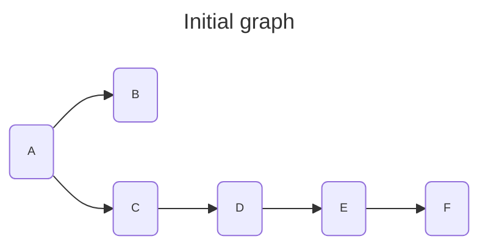
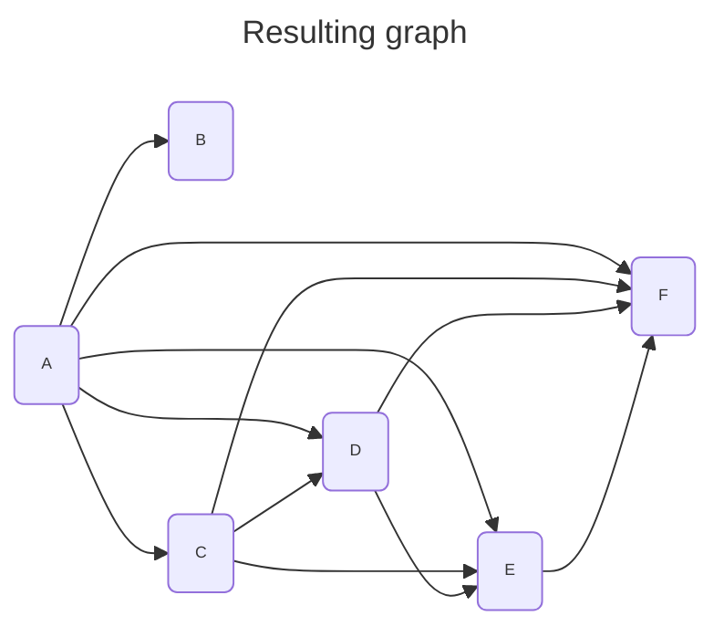

<div align="center">
    
</div>
<hr/>

# Transitive closure
This algorithm transforms an existing graph $G(V,E)$ by adding edges between node which are indirectly connected.

So int the resulting graph $\forall (i,j,k)$, if the edge $G(i,k)$ exists and the edge $G(k,j)$ exists, the edge $G(i,j)$ will be added if it doesn't exist.






## Requirements
- the graph must be directed
- the graph must be acyclic (no cycle allowed)

## Complexity
- In a dense graph (highly connected), the complexity is $\lVert V \rVert^3$
- But it tends to $\lVert V \rVert^2$, the sparser the graph is.

## Usage
```C++
    #include <grafology/algorithms/transitive_closure.h>
    namespace g = grafology;

    g::SparseDirectedGraph g(20);
    // ....
    g::transitive_closure(g);
    // ....

```
