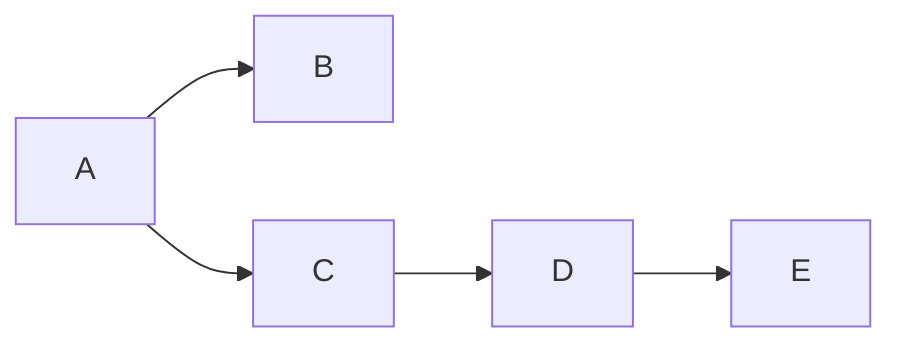

    

# Transitive closure
This algorithm transforms an existing graph $G(V,E)$ by adding edges between node which are indirectly connected.

So int the resulting graph $\forall{i,j,k}$, if $\exists\,G(i,k)$ and $\exists\,G(k,j)$, the edge $G(i,j)$ will be added if it doesn't exist.

<table>
<tr>
    <th stule="align: center"> Initial graph</th>
    <th> Resulting graph</th>
</tr>

<tr>
    <td>

    </td>
    <td>
        

    </td>
</tr>
</table>

## Requirements
- the graph must be directed
- the graph must be acyclic (no cycle allowed)

## Complexity
- In a dense graph (highly connected), the complexity is $\lVert E \rVert^3$
- But it tends to $\lVert E \rVert^2$, the sparser the graph is.
